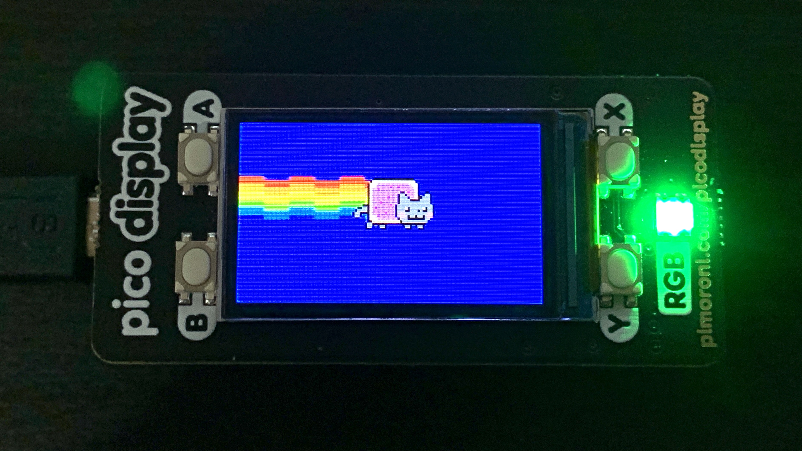

# rpi-pico-nyan-cat
Use Raspberry Pi Pico + Pimoroni pico display to create the Nyan Cat animation.

## Usage

1. Install Micropython on the Pico
2. Upload all the `.raw` files in the `artwork` folder to the Pico
3. Upload the `main.py` file to the Pico 
4. Reset & Enjoy!

## About

The cat animation is generated from a sequence of sprites, which looks exactly like below:

The sprites are converted from `.png` to Python bytearray with the `image-convertor.py`.

The rainbow is generated in real-time with the colour-pattern.

## Credit

The idea is from the original Nyan Cat:

## 
